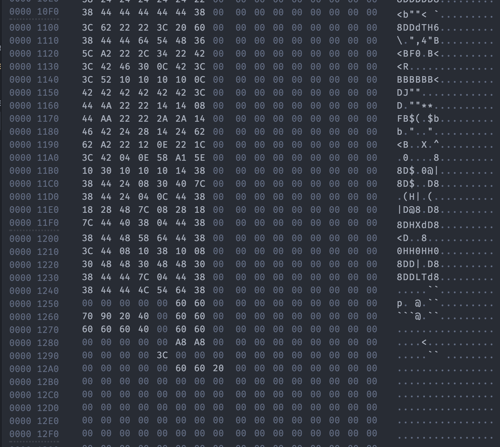

# Hix

> A hex editor for Atom

Hix is a hex editor for the [Atom](http://atom.io) text editor that provides a hex view for any document. Unlike other hex dumper programs, it allows for direct editing of files, in lieu of a plaintext mode.



# Installation
1. Navigate to `~/.atom/packages`
(In the Atom app go to Settings and press **Open Config Folder**, then navigate to `/packages`)
2.
```
git clone https://github.com/ACqua42/hix.git
cd hix
apm install
apm link .
```
3. Profit! You should see `hix` in the **Community Packages** section of Atom settings.

# License
Licensed under the MIT license. Read about it [here](LICENSE).
